<style>
section::after {
  content: attr(data-marpit-pagination) '/' attr(data-marpit-pagination-total);
}
</style>


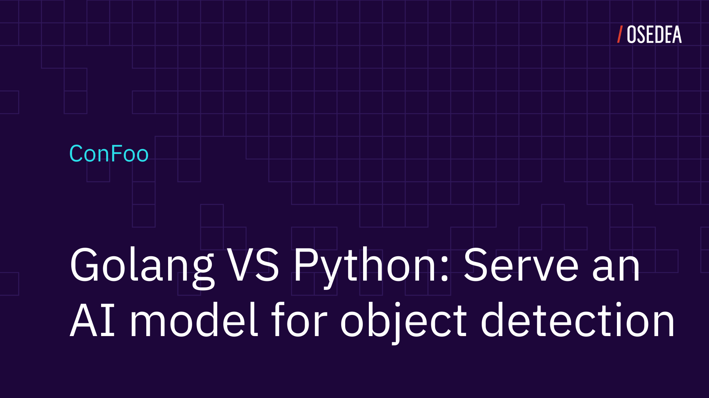

---

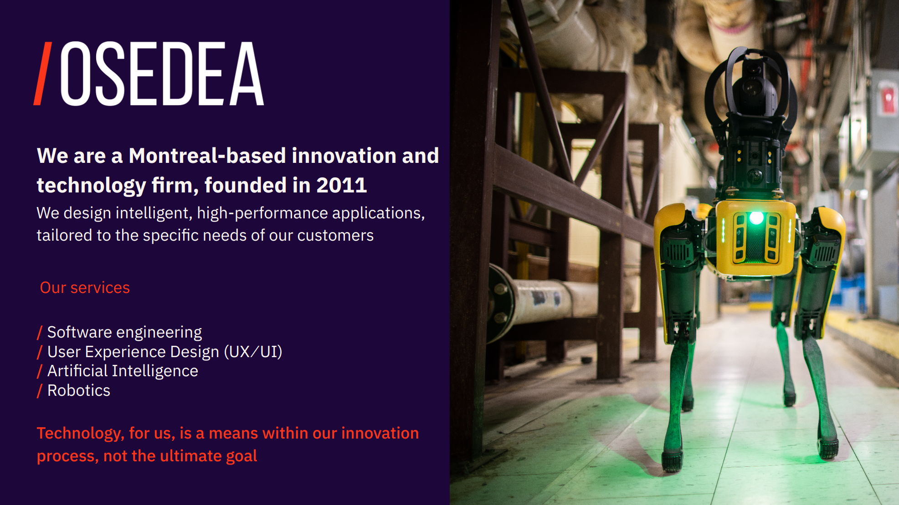

---

# Objectif of the presentation

---

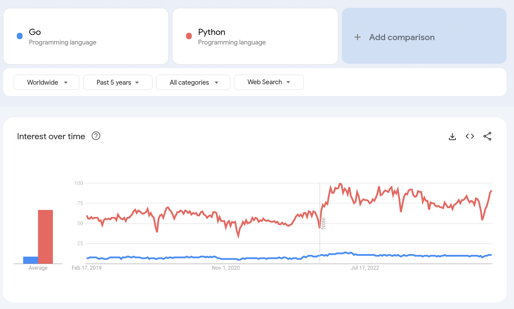

---

# Tools

- Python 3.11.7
- Go version go1.22.0 linux/amd64
- OpenCV version:  4.9.0
- YoloV4

---

## What is Python?

Python is a high-level, general-purpose programming language

---

## What is Go?

Go is a statically typed, compiled high-level programming language designed at Google

---

## How to run them?

```bash
python main.py

go build main.go
./main
```

Faster way to run code in dev

```bash
go run main.go
```

---

## Hello Confoo

```py
# python
print("Hello Confoo!")
```

```go
// go
package main

import "fmt"

func main() {
    fmt.Println("Hello Confoo!")
}
```

---

# Typed vs. Untyped

---

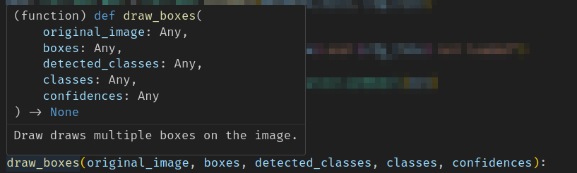

---


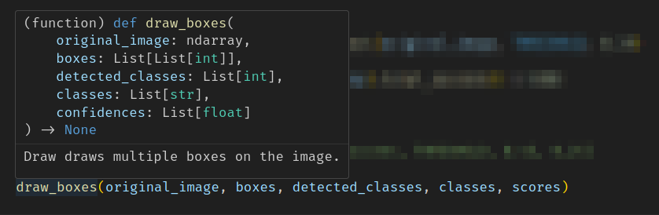

---

# You should type

---

```py
# python
i = 3

j: int = 3
```

```go
// go
var i int
i = 3

j := 4
```

---

### Functions

---

```py
# python
def addition(x: int, y: int) -> int:
    return x + y
```

```go
// go
func addition(x int, y int) int {
    return x + y
}
```

---

### Bonus points


```go
// go
func subtraction(x int, y int) int {
    var z int
    return x - y
}
```

```bash
# confoo24.inference/playground
./playground.go:23:6: z declared and not used
```


```go
// go
func subtraction(x int, y int) (z int) {
    z = x - y
    return
}
```

---


# Let's dive in

---

```py
# python
if __name__ == "__main__":
    # Parse the command line arguments
    parser = argparse.ArgumentParser()
    parser.add_argument("--img", default=str("person.jpg"), help="Path to input image.")
    args = parser.parse_args()

    # Load the model and classes
    net_model: cv2.dnn.DetectionModel = load_model(
        "yolov4-tiny.weights", "yolov4-tiny.cfg"
    )
    with open("classes.yml", "r") as file:
        config: dict = yaml.safe_load(file)
        classes: List[str] = config["names"]

    detect(net_model, args.img, classes)
```

---

```go
// go
// main function
func main() {
    // Parse the command line arguments
    img := flag.String("img", "person.jpg", "Path to input image.")
    flag.Parse()

    // Load the model and classes
    netModel := loadModel("yolov4-tiny.weights", "yolov4-tiny.cfg")
    classes := loadYAML("classes.yml")

    detect(netModel, *img, classes)
}
```

What is `*img`?

---

# Oh that's a pointer...

---

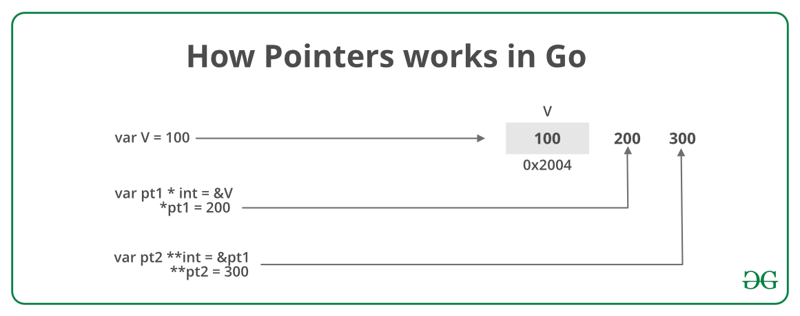

---

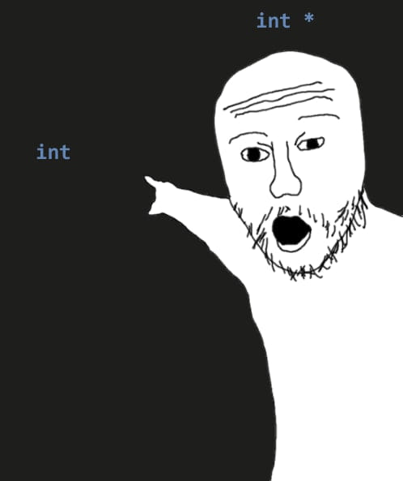

---

```go
// go
func main() {
    x := 42
    p := &x

    fmt.Println("x", x)
    fmt.Println("p", p)
    fmt.Println("&x", &x)
    fmt.Println("*p", *p)
    fmt.Println("*&x", *&x)
    fmt.Println("*&*&*&*&*&*&*&*&*&x", *&*&*&*&*&*&*&*&*&x)
}
```

```bash
x   42
p   0xc000012158
&x  0xc000012158
*p  42
*&x 42
*&*&*&*&*&*&*&*&*&x 42
```

---

### Back to main

What is `*img`?

---

`*img` is just the file name

```bash
python main.py --img bus.jpg

go run main.go --img bus.jpg
```

---

### Load model

---

```py
# python
def load_model(weights_file: str, cfg_file: str) -> cv2.dnn.DetectionModel:
    """Load yolo model with cv.dnn."""

    net: cv2.dnn.Net = cv2.dnn.readNet(weights_file, cfg_file)

    if net.empty():
        raise ValueError(f"Model {weights_file} and {cfg_file} not loaded")

    model: cv2.dnn.DetectionModel = cv2.dnn.DetectionModel(net)

    return model
```

What is `cv2.dnn.readNet`?

---

```go
// go
// init loads the Yolo model.
func loadModel(yoloModelName string, yoloModelCfg string) gocv.Net {
    net := gocv.ReadNet(yoloModelName, yoloModelCfg)

    if net.Empty() {
        panic("Failed to load the model")
    }

    return net
}
```

---

## What is this yolo model?

---

You only look once (YOLO)

=

- Image Recognition
- Image Localization

---


---

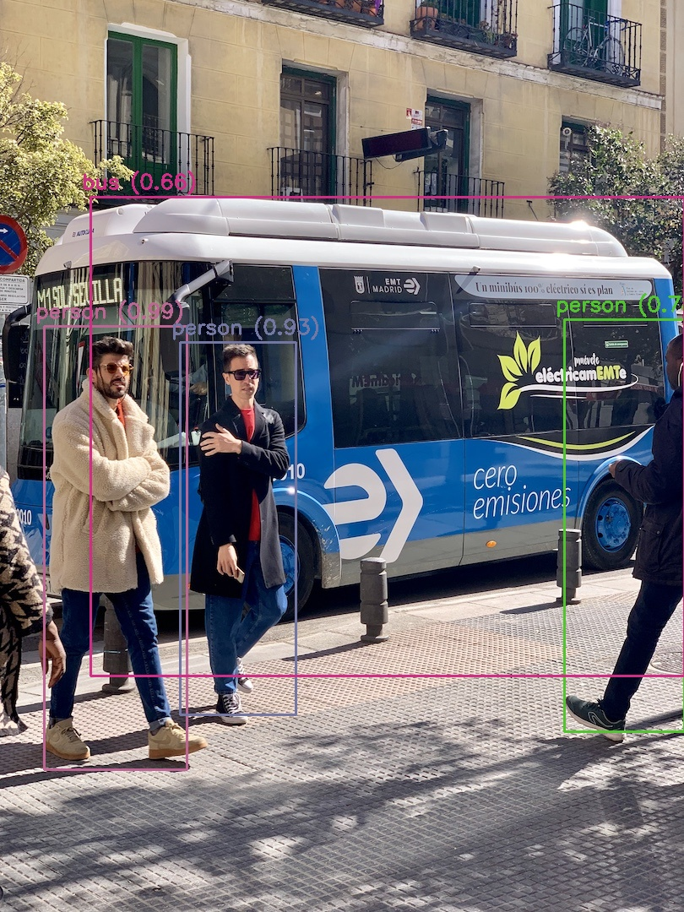

---

### Load yaml

---

```py
# python
with open("classes.yml", "r") as file:
    config: dict = yaml.safe_load(file)
    classes: List[str] = config["names"]
```

```go
// go
// loadYAML loads the YAML file and returns the Config struct
func loadYAML(filename string) []string {
    var config Config
    data, err := os.ReadFile(filename)
    if err != nil {
        panic(err)
    }
    err = yaml.Unmarshal(data, &config)
    if err != nil {
        panic(err)
    }
    return config.Names
}
```

---

> Marshalling is the process of transforming memory representation of an object into a data format suitable for storage

[Marshalling Wikipedia](https://en.wikipedia.org/wiki/Marshalling_(computer_science))

---

### Checkpoint


---

- Basic Python and Go structure
  - How to run program
  - Variables, function
  - Standard file structure
- Typing
- Pointers
- Basic Yolo concept
- File read and data marshalling

---


```py
# python
def detect(net: cv2.dnn.DetectionModel, input_image: str, classes: List[str]):
    """Perform inference on the input image."""

    # Read the image
    original_image: np.ndarray = cv2.imread(input_image)

    # Prepare the model
    net.setInputParams(size=(416, 416), scale=1 / 255, swapRB=True)

    # Perform inference
    detected_classes, scores, boxes = net.detect(original_image, THRESHOLD, 0.25)

    # Draw boxes on image
    draw_boxes(original_image, boxes, detected_classes, classes, scores)

    # Save the image
    cv2.imwrite("python_inference.jpg", original_image)

```

---

```go
// go
// detect perform inference on the input image
func detect(net gocv.Net, imgPath string, classes []string) {

    // Read the image
    b, err := os.ReadFile(imgPath)
    img, err := gocv.IMDecode(b, gocv.IMReadAnyColor)

    // Prepare the model
    blob := gocv.BlobFromImage(img, 1/255.0, image.Pt(416, 416), gocv.NewScalar(0, 0, 0, 0), true, false)
    net.SetInput(blob, "")

    // Perform inference
    probs := net.ForwardLayers(getOutputLayerNames(&net))

    // Postprocess the output
    detected := postProcess(probs, 0.4, float32(img.Cols()), float32(img.Rows()), classes)

    // Draw boxes on image
    drawBoxes(&img, detected)

    // Save the image
    gocv.IMWrite("golang_inference.jpg", img)
}
```

---

### Reading the image

---

```py
# python
# Read the image
original_image: np.ndarray = cv2.imread(input_image)
```

```go
// go
// Read the image
b, err := os.ReadFile(imgPath)
if err != nil {
    panic(err)
}

img, err := gocv.IMDecode(b, gocv.IMReadAnyColor)
if err != nil {
    panic(err)
}
defer img.Close()
```

---

### Prepare the network

---

Define model input:

```py
# python
net.setInputParams(size=(416, 416), scale=1 / 255, swapRB=True)
```

```go
// go
gocv.BlobFromImage(img, 1/255.0, image.Pt(416, 416), gocv.NewScalar(0, 0, 0, 0), true, false)
```

Image, Scale, Size, Mean value to substract for channels, swapRB, crop

---

## Detect objects

---

```py
# python
detected_classes, scores, boxes = net.detect(original_image, THRESHOLD, 0.25)
```

```go
// go
// Perform inference
probs := net.ForwardLayers(getOutputLayerNames(&net))

// Postprocess the output
detected := postProcess(probs, 0.4, float32(img.Cols()), float32(img.Rows()), classes)
```

---

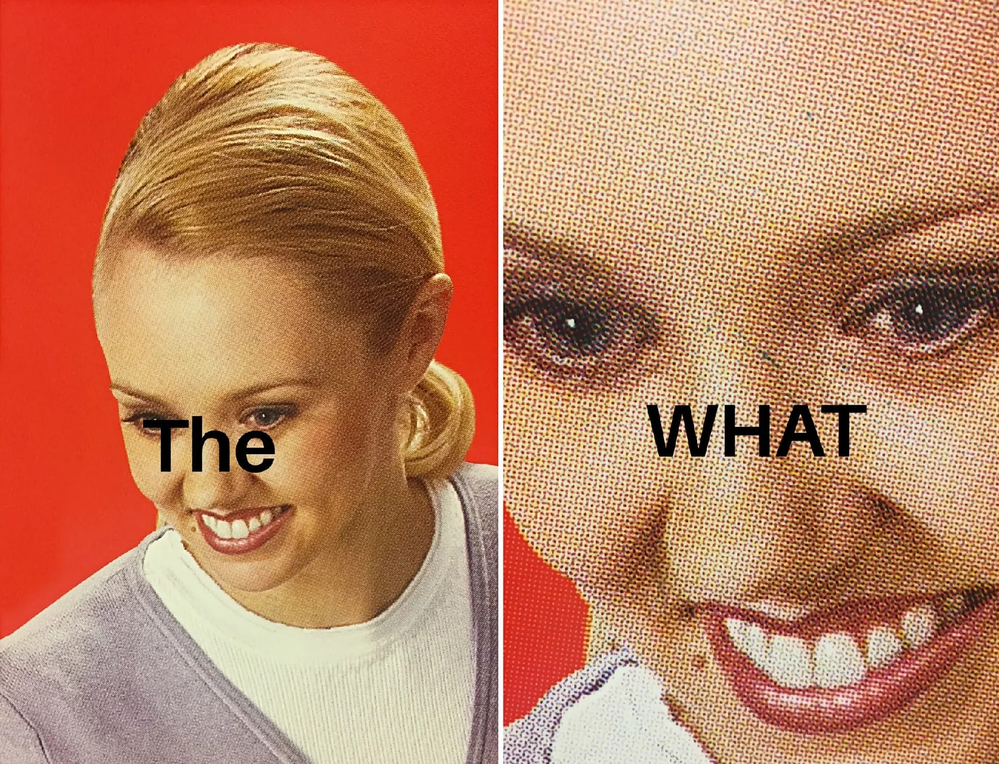

`net.ForwardLayers(getOutputLayerNames(&net))`

---

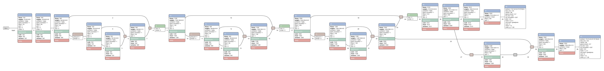

---

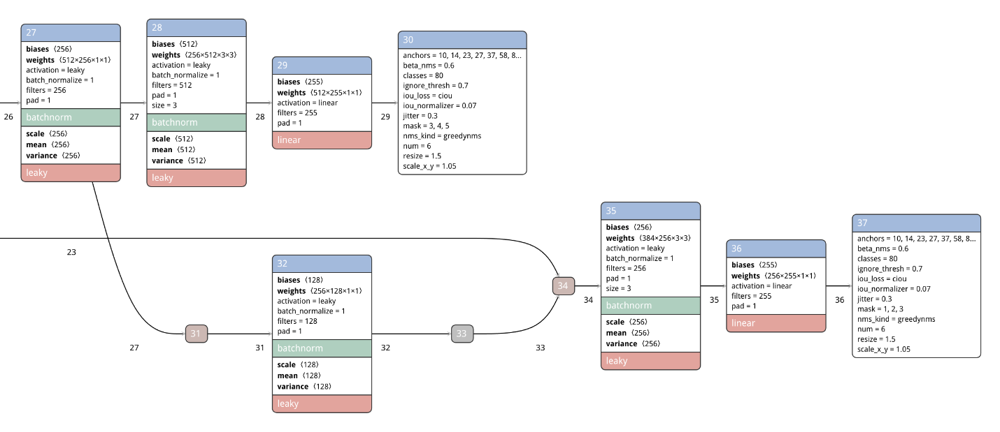

---

```go
// go
// getOutputLayerNames outputs layer names from the Yolo model.
func getOutputLayerNames(net *gocv.Net) []string {
    var outputLayers []string
    for _, i := range net.GetUnconnectedOutLayers() {
        layer := net.GetLayer(i)
        layerName := layer.GetName()
        outputLayers = append(outputLayers, layerName)
    }

    return outputLayers
}
```

---

### Post processing

---


```go
// go
// Postprocess the output
detected := postProcess(probs, 0.4, float32(img.Cols()), float32(img.Rows()), classes)
```

---

**How it works**

- 

1. Loop over the output of the model
2. Read and compute fancy values
3. Save it to a structure
4. Clean that structure

---

```go
// go
// postProcess processes the output of the Yolo model.
func postProcess(detections []gocv.Mat, nmsThreshold float32, frameWidth, frameHeight float32, netClasses []string) []*DetectedObject {
    var detectedObjects []*DetectedObject
    var boundingBoxes []image.Rectangle
    var accuracyList []float32

    for i, yoloLayer := range detections {
        cols := yoloLayer.Cols()
        data, err := detections[i].DataPtrFloat32()
        if err != nil {
            panic(err)
        }

        // Iterate Yolo results
        for j := 0; j < yoloLayer.Total(); j += cols {
            row := data[j : j+cols]
            scores := row[5:]

            classID, accuracy := getClassIDAndAccuracy(scores)
            className := netClasses[classID]

            // Remove the bounding boxes with low accuracy
            if accuracy > threshold {
                // Calculate bounding box
                boundingBox := calculateBoundingBox(frameWidth, frameHeight, row)

                // Append data to the lists
                accuracyList = append(accuracyList, accuracy)
                boundingBoxes = append(boundingBoxes, boundingBox)
                detectedObjects = append(detectedObjects, &DetectedObject{
                    Rect:      boundingBox,
                    ClassName: className,
                    ClassID:   classID,
                    Accuracy:  accuracy,
                })
            }
        }
    }

    return something
}
```

---

```go
// go
// ...
for i, yoloLayer := range detections {
    cols := yoloLayer.Cols()
    data, err := detections[i].DataPtrFloat32()
    if err != nil {
        panic(err)
    }
// ...
```

---

```go
// go
// ...
// Iterate Yolo results
for j := 0; j < yoloLayer.Total(); j += cols {
    row := data[j : j+cols]
    scores := row[5:]

    classID, accuracy := getClassIDAndAccuracy(scores)
    className := netClasses[classID]
// ...
```

---

```go
// go
// Remove the bounding boxes with low accuracy
if accuracy > threshold {
    // Calculate bounding box
    boundingBox := calculateBoundingBox(frameWidth, frameHeight, row)

    // Append data to the lists
    accuracyList = append(accuracyList, accuracy)
    boundingBoxes = append(boundingBoxes, boundingBox)
    detectedObjects = append(detectedObjects, &DetectedObject{
        Rect:      boundingBox,
        ClassName: className,
        ClassID:   classID,
        Accuracy:  accuracy,
    })
}
```

---

# Working version

---

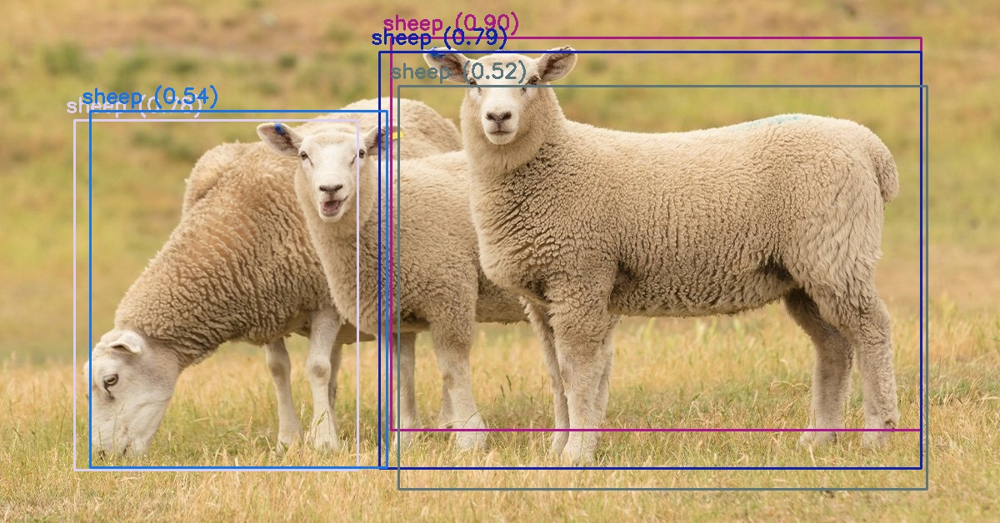

---

# But I want this

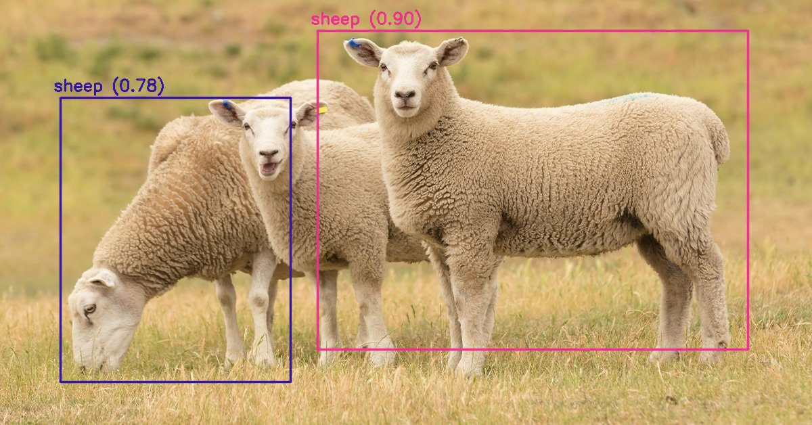

---

# Non-maximum Suppression (NMS)

---


---

```py
# python
detected_classes, scores, boxes = net.detect(original_image, THRESHOLD, 0.25)
```

```py
# python
nmsThreshold: float = 0.25
```

```go
// go
indices := make([]int, len(boundingBoxes))
for i := range indices {
    indices[i] = -1
}

// Apply non-maximum suppression
indices = gocv.NMSBoxes(boundingBoxes, accuracyList, threshold, nmsThreshold)
filteredDetectedObjects := make([]*DetectedObject, 0, len(detectedObjects))
for i, idx := range indices {
    if idx < 0 || (i != 0 && idx == 0) {
        // Eliminate zeros, since they are filtered by NMS (except first element)
        // Also filter all '-1' which are undefined by default
        continue
    }
    filteredDetectedObjects = append(filteredDetectedObjects, detectedObjects[idx])
}
```
---

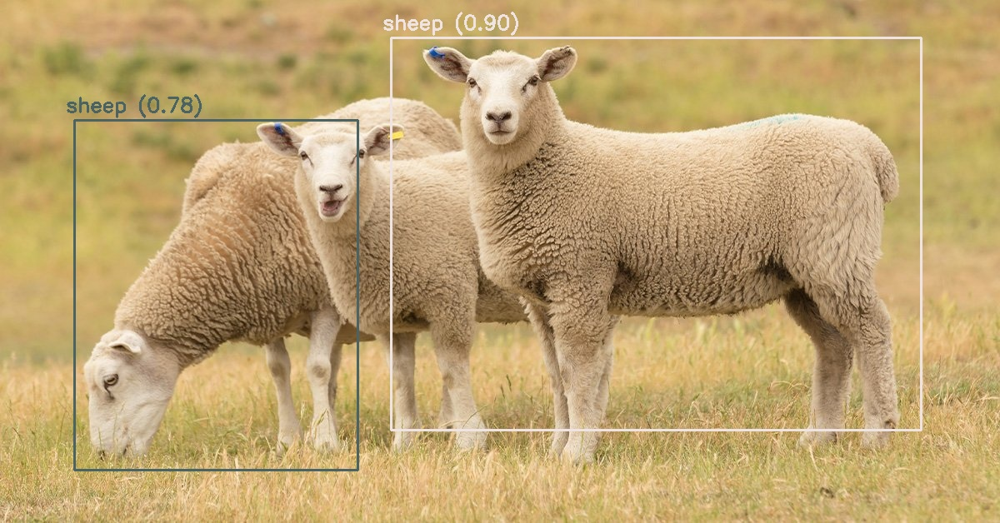


---

# Results

---


---

Average inference time in Python: 93.99 ms

---


---

Average inference time in Golang: 84.81 ms

---

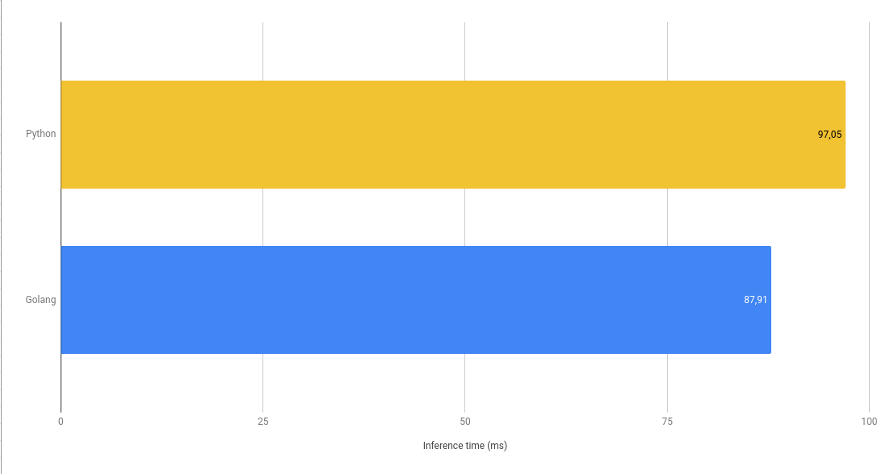

---

**~10.8 %** inference time increase

---


# Questions?


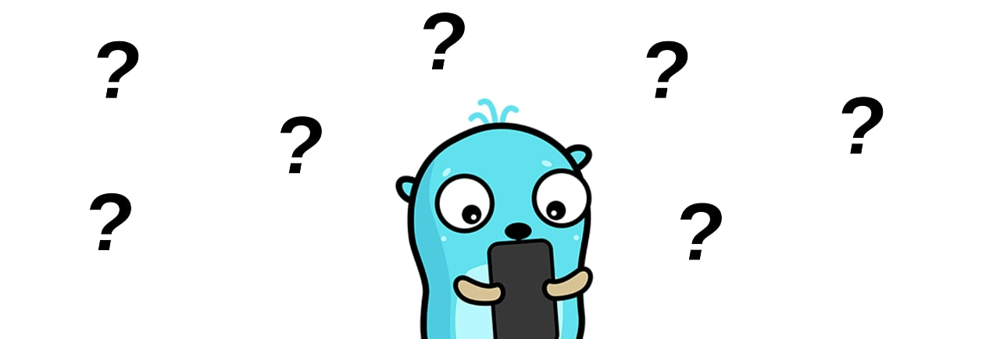

https://github.com/ArmandBriere/confoo2024

---

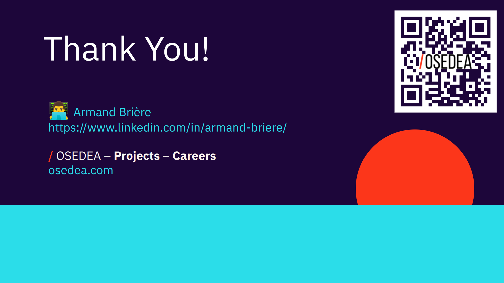
